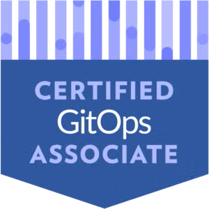

# Certified GitOps Associate — Mock Exam


<p align="center" width="100%">
    
</p>

This repository provides a single-page web app for practicing Certified GitOps Associate (CGOA) exam questions. The app is built with Node.js and serves a quiz interface with multiple-choice questions.

---

## 🚀 Features

- Multiple-choice questions based on the official CGOA practice exam
- Instant feedback and explanations
- Sectioned questions for focused study
- Dockerized for easy deployment

---

## 📁 Project Layout

```bash
cgoa-mock-exam/
├── Dockerfile
├── .dockerignore
├── app/
│   ├── package.json
│   ├── server.js
│   ├── public/
│   │   ├── index.html
│   │   ├── app.js
│   │   ├── styles.css
│   ├── data/
│   │   ├── questions.json
```

---

## 🛠️ Usage

### Run the pre-build container

```sh
docker run --name cgoa-mock-exam -p 3000:3000 hiddevg/cgoa-mock-exam:latest
```

## 💻 Development usage

### Build the Docker image

```sh
docker build -t cgoa-mock-exam:latest .
```

### Run the container (port 3000)

```sh
docker run --rm -p 3000:3000 cgoa-mock-exam:latest
```

Open [http://localhost:3000](http://localhost:3000) in your browser to start practicing.

---

## 📝 Contributing

Pull requests and suggestions are welcome! Feel free to submit new questions, improvements, or bug fixes.

---

## 📄 License

This project is licensed under the MIT License.

Some questions in this repository are adapted from [Certified GitOps Associate CGOA](https://gitlab.com/cncf-exams/certified-gitops-associate-cgoa)
